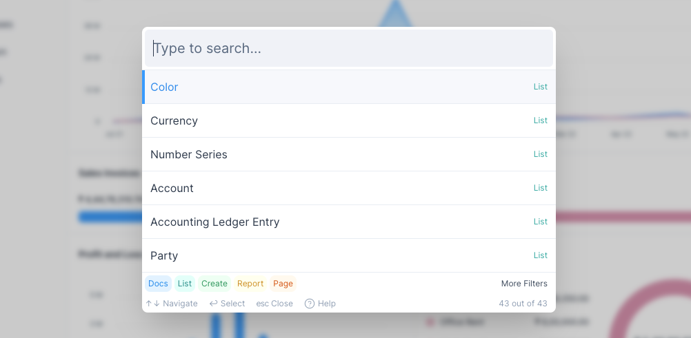
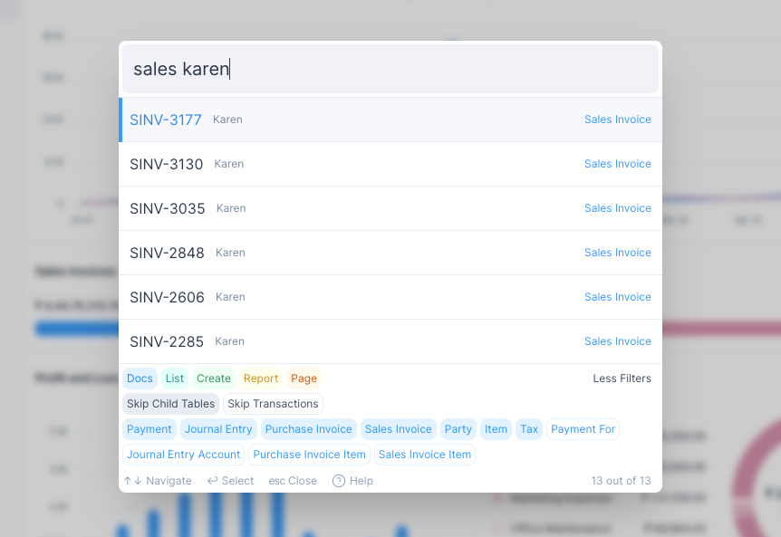
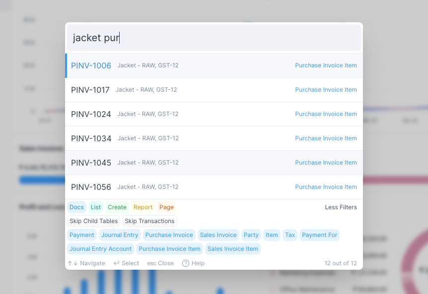
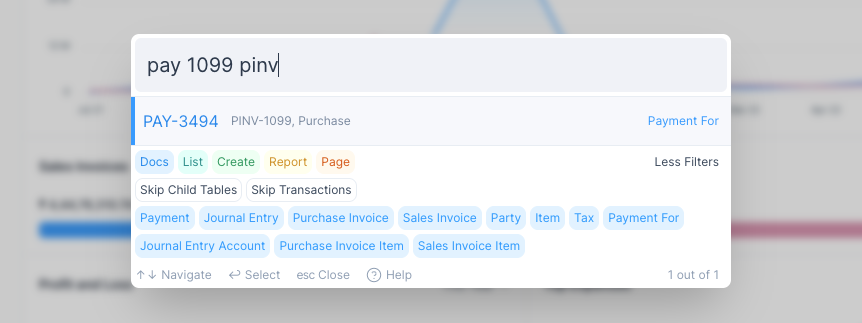
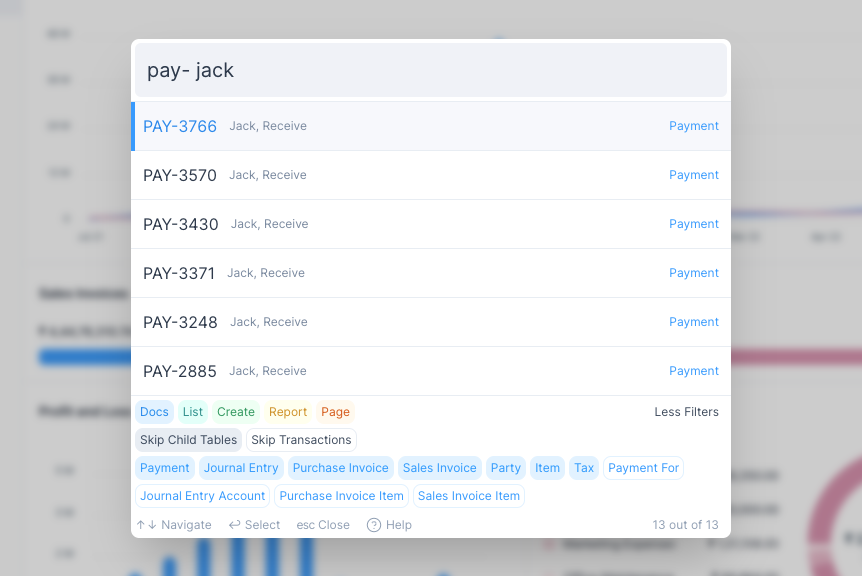

# Search

The Search interface is a quick way to navigate around in Frappe Books. To
activate it you can click on the search button in the header:

Or you can press `Ctrl + K` or `Cmnd + K` depending on your operating system.

## Search Dialog

To search for anything type what you are looking for in the input bar at the
top.

::: tip Fuzzy Search
Because of the fuzzy search method used, you don't have to type the exact name
of the thing you are searching.

So if you make spelling mistakes it is fine, you will still find what you are
looking for.
:::

Each row in the search results is classified as one of the following Types:

|   # | Type   | Color  | Purpose                                            | Example          |
| --: | :----- | :----- | :------------------------------------------------- | :--------------- |
|   1 | Docs\* | blue   | Opens the selected entry                           | PAY-1001         |
|   2 | List   | teal   | Opens the List View                                | Sales Items      |
|   3 | Create | green  | Opens a Form or Quick Edit Form to create an entry | Purchase Invoice |
|   4 | Report | yellow | Opens the selected report                          | General Ledger   |
|   5 | Page   | red    | Opens the page                                     | Dashboard        |

::: info Docs\*
Rows of the _Docs_ type will show they type of entry it is. For example, Item or
Purchase Invoice.
:::

In the bottom section you will find the filters which will help you narrow your
search results.

## Search Filters

Clicking on More Filters will display all the filters.

There are two kinds of filters here.

1. Regular Filters: coloured buttons in the first row.
2. Doc Filters: blue coloured buttons after the first row.

::: tip Skip Filters
Skip Child Tables and Skip Transactions are used to toggle multiple Doc Filters
at once.
:::

### Regular Filters

Clicking on one of the regular filters will exclude that type from the search.

For example, if you unselect Doc then only List, Create, Report and Page type
rows will show in the suggestions.

### Doc Filters

Clicking on a Doc filter will exclude that kind of entry from the search.

For example, if you unselect Payment, all Payments will be excluded from the
search.

## Examples

The Search functionality is very powerful, you can run various kind of queries
just by entering a few letters.

Here are a few examples.

1. Finding all the Sales Invoices created for Karen 

2. Finding all the Purchases Invoices with the item Jacket

3. Finding the Payment for Purchase Invoice PINV-1099

4. Finding all Payments received from Jack

::: tip Keyword Order
The order of the keyword doesn't matter. You can enter the search keywords in
any order.
:::
