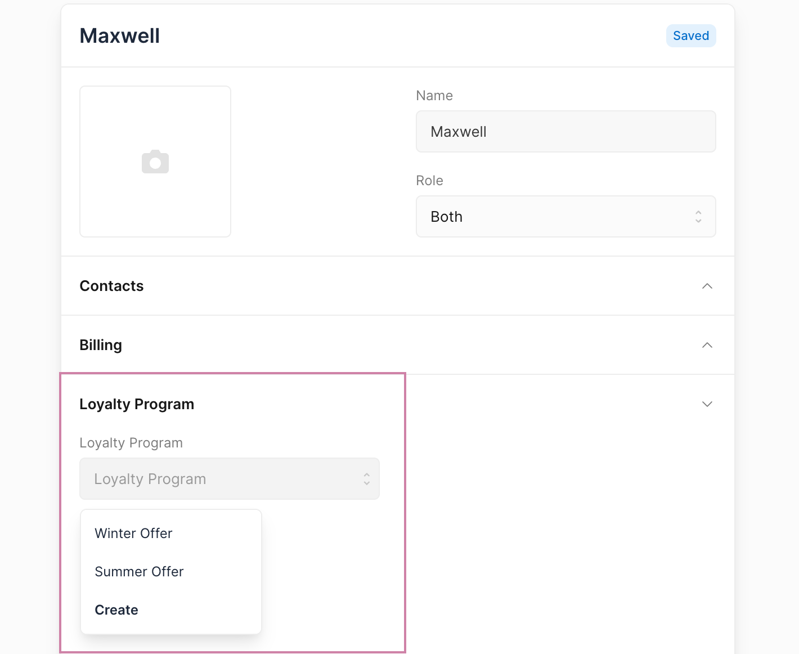
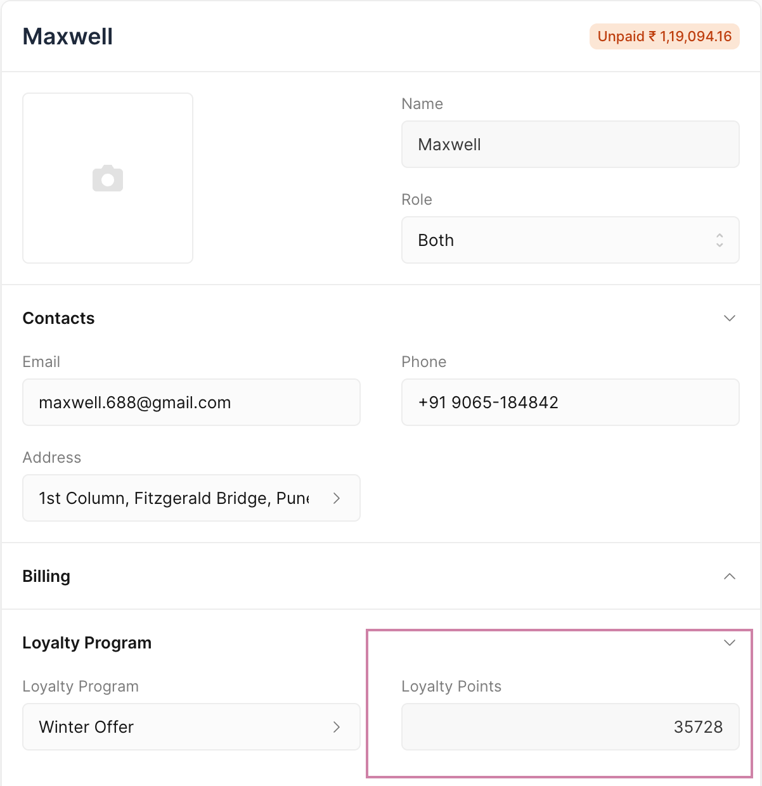

# Loyalty Program

Loyalty Program is used to reward customers with points for their purchases, which can then be redeemed on their future purchases.

## Enabling Loyalty Program

To enable Loyalty Program, you will have to first check the Enable Loyalty Program in the General Settings.

Once that is done you will have to restart Frappe Books to see the Loyalty Program in the sidebar.

::: warning

Loyalty Program cannot be disabled once it has been enabled.
:::

## Creating Loyalty Program

To create a Loyalty Program first navigate to the Loyalty Program page

`Sales > Loyalty Program`

Then click on the `+` button to open the Loyalty Program form.

1. Enter a unique name for the Loyalty Program.
2. Add the From and To Date for program's validity period.
3. Ensure the **IsEnabled** checkbox is checked. This will mark the program active.
4. Collection Rules:

    - **Tier name:** To differentiate between different levels of rewards.
    - **Collection Factor:** How much amount needs to be spent to gain 1 Loyalty Point.
    - **Minimum Amount:** Minimum amount to be spent to qualify into a tier.

5. Set an **Expense Account** from where you'll offer the benefits. This is useful to track the benefits offered separately.
6. Set the number of days in the Expiry Duration field after which the loyalty points will expire.

## Loyalty Program in Customer 

Set a Loyalty Program in the Customer to assign a Loyalty Program.

Loyalty points earned can be viewed in the Customer.

## Loyalty Program Functionality

### Earning Points 
1. Assign Loyalty Program to a Customer.
2. Create a new Sales Invoice for the Customer to whom you have assigned Loyalty Program.
3. For this example, an Sales Invoice is created with a grand total of 3,000 INR. According to the Loyalty Program, if a customer spends a minimum of 2,000 INR, they are eligible to earn loyalty points. For every 300 INR spent, the customer will receive 1 loyalty point. Therefore, with a total spend of 3,000 INR, the customer earns 10 loyalty points.
4. Upon submission of the Sales Invoice, a Loyalty Point Entry will be created for this Sales Invoice. This acts as a log to give an overview of which Customer earned how many points against which Sales Invoice.

### Redeeming Points 

1. When creating an Sales Invoice for a Customer who has loyalty points, go to the Loyalty Point Redemption section and enable the checkbox **Redeem Loyalty Points**.
2. The fields for **Loyalty Points** will become visible under this section. You can fill in the points to redeem.
3. The total amount of the Sales Invoice will be adjusted based on the redeemed points, and you will only need to pay the remaining balance after the points have been applied.

